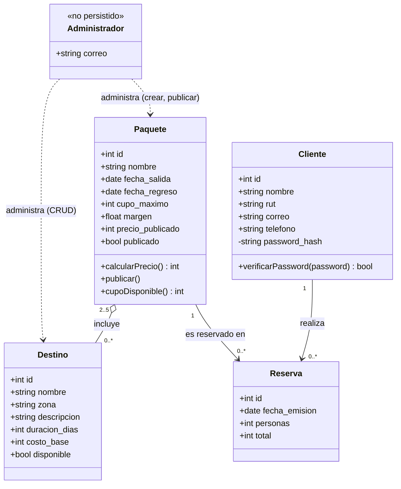

# Modelo UML — Viajes Aventura

Diagrama de clases del dominio, derivado del esquema de `backend/app/database.py` y las 17 reglas de negocio (R1-R17) descritas en `Viajes_aventura.pdf` y `README.md`. Se renderiza directamente en GitHub (sintaxis [Mermaid](https://mermaid.js.org/)).

## Reglas de negocio representadas

| Elemento del diagrama | Reglas |
|---|---|
| Atributos de `Destino` y su unicidad de `nombre` | R1, R2 |
| Asociación `Paquete` 2..5 `Destino`, sin repetidos | R3, R4 |
| Atributos de `Paquete` (fechas, `cupo_maximo`) | R5 |
| `Paquete.calcularPrecio()` | R6 |
| `Paquete.publicar()` fija `precio_publicado` | R7 |
| `Destino.disponible` (baja lógica) | R8 |
| Atributos de `Cliente`, `correo` único | R9 |
| `password_hash` privado + `verificarPassword()` | R10 |
| Asociación `Cliente` → `Reserva` (solo el propio cliente) | R11 |
| Atributos de `Reserva` | R12 |
| `total` fijado al crear la reserva | R13 |
| `Paquete.cupoDisponible()` | R14 |
| Validación de `fecha_salida` vigente al reservar | R15 |
| `personas >= 1` | R16 |
| `rut`/`telefono` sin getter público expuesto por la API | R17 |

## Notas de diseño

- **`Administrador` no es una tabla de la base de datos.** El caso describe un único administrador (uno de los socios, ver `Viajes_aventura.pdf` §1.3), así que sus credenciales se configuran por variable de entorno (`ADMIN_EMAIL`, `ADMIN_PASSWORD`) en vez de modelarse como una entidad persistida — ver `backend/app/seguridad.py` y el Cambio 10 de `VALIDACION_IA.md`.
- `Reserva` no tiene una relación directa "de muchos a muchos" con `Destino`: la relación de negocio es `Cliente` → `Reserva` → `Paquete` → `Destino`.
- Los métodos mostrados (`calcularPrecio`, `publicar`, `cupoDisponible`, `verificarPassword`) son responsabilidades de negocio; en la implementación actual (FastAPI + SQL directo, sin ORM) viven como funciones en `backend/app/paquetes.py`, `backend/app/seguridad.py` y `backend/app/reservas.py` en vez de como métodos de una clase de dominio — el diagrama documenta el modelo conceptual, no la estructura literal del código.
